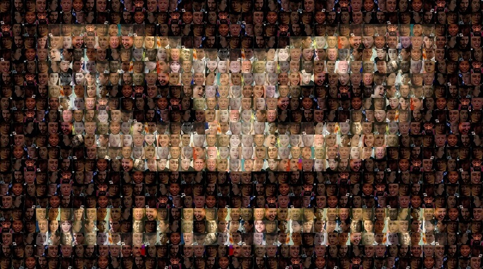
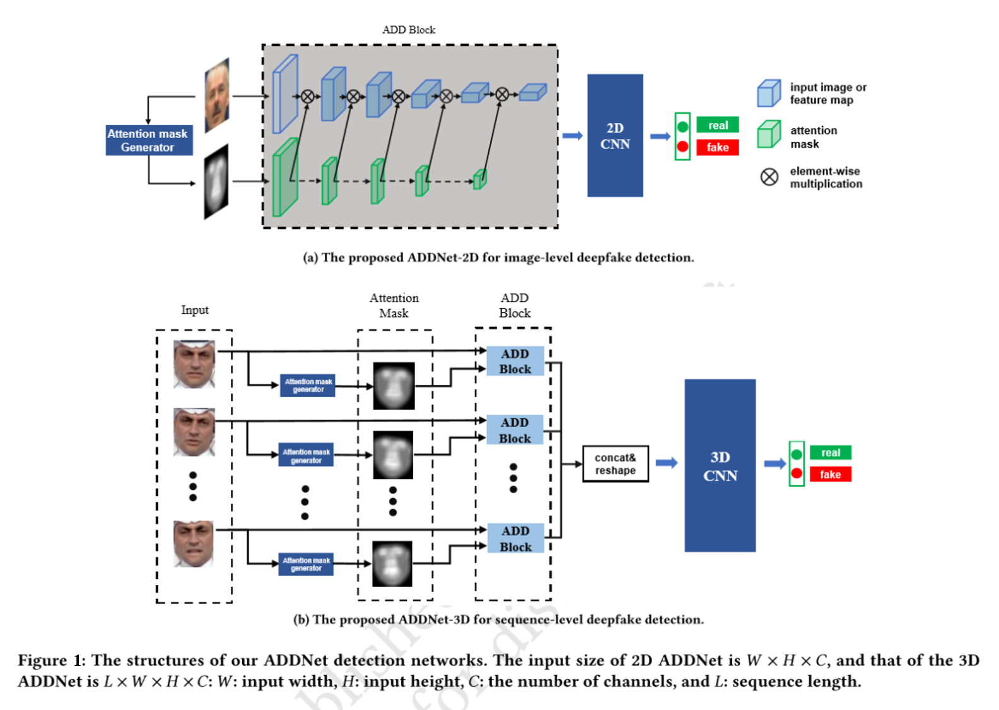
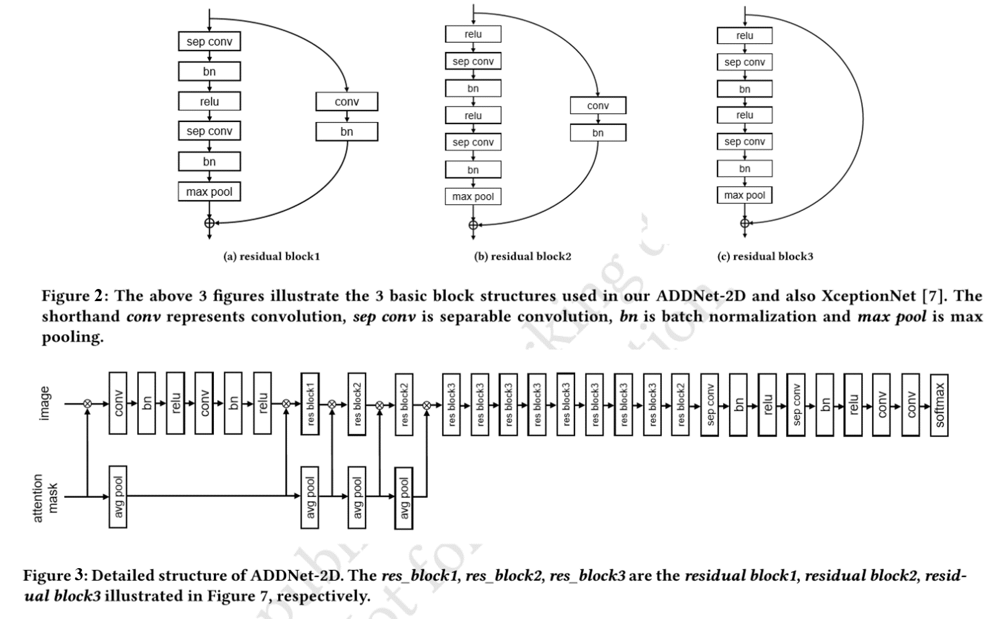
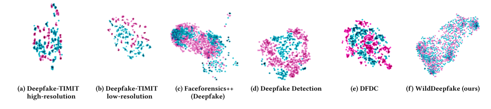

# WildDeepfake: A Challenging Real-World Dataset for Deepfake Detection

##  Abstact
   In recent years, the abuse of a face swap technique called deepfake Deepfake has raised enormous public concerns. Deepfake manipulates deep learning techniques to replace one person's face in a video with someone else's without leaving obvious traces.  So far, a large number of deepfake videos (also known as "deepfakes") have been crafted and uploaded to the internet, which calls for the development of effective countermeasures. One promising countermeasure against deepfakes is deepfake detection. Several deepfake datasets have been released to support the training and testing of deepfake detectors, such as DeepfakeDetection and FaceForensics++. While this has greatly advanced deepfake detection, most of the real videos in these datasets are filmed with a few volunteer actors in limited scenes. The fake videos are crafted by researchers using a few popular deepfake software. Detectors developed on these datasets may lose effectiveness when applied to detect the vast variety of deepfake videos in the wild (those uploaded to various video-sharing websites). To better support detection against real-world deepfakes, in this paper, we introduce a new dataset **WildDeepfake**, which consists of **7,314** face sequences extracted from **707** deepfake videos that are collected completely from the internet. WildDeepfake is a small dataset that can be used, in addition to existing datasets, to develop more effective detectors against real-world deepfakes. We systematically evaluate a set of baseline detection networks on both existing and our WildDeepfake datasets, and show that WildDeepfake is indeed a more challenging dataset, where the detection performance can decrease drastically. We also propose two (eg. 2D and 3D) Attention-based Deepfake Detection Networks (ADDNets) to leverage the attention masks on real/fake faces for improved detection. We empirically verify the effectiveness of ADDNets on both existing and WildDeepfake.

</img>

**The new manager of this dataset is Prof. Xingjun Ma. If you have questions, feel free to send email to him (danxjma@gmail.com)**

## FACE PRIVACY Statement
We have done the following to ensure face privacy in the dataset. 
* Our dataset is used only for research purposes, we only release the face sequence rather than the whole video.
* We block the key parts of the face in the paper and slides. We also set up strict access rules. 
* When applicants apply, we will check the applicant’s academic email address, personal electronic signature, and other necessary information.
* We require the applicant to sign a strict agreement to ensure that the dataset is used only for research purposes.
* If some parts of the dataset affect you, you can [contact us](danxjma@gmail.com) to remove them.

## Introduction
   **Previous datasets**
   
   |       Dataset name       |         Download         |Generate method|      Deepfake videos     |           Actors           |
   |--------------------------|--------------------------|----|--------------------------|----------------------------|
   |   Deepfake-TIMIT low     |[download](https://www.idiap.ch/dataset/deepfaketimit)|Deepfake|320|32|
   |   Deepfake-TIMIT high    |[download](https://www.idiap.ch/dataset/deepfaketimit)|Deepfake|320|32|
   |   Faceforensics          |-|Deepfake|1000|977|
   |   Faceforensics++        |[download](https://github.com/ondyari/FaceForensics)|Deepfake|1000|977|
   |   Deepfake detection     |[download](https://ai.googleblog.com/2019/09/contributing-data-to-deepfake-detection.html)|Deepfake|over3000|28|
   |Celeb-deepfakeforensics v1|[download](https://github.com/danmohaha/celeb-deepfakeforensics)|Deepfake|795|13|
   |Celeb-deepfakeforensics v2|[download](https://github.com/danmohaha/celeb-deepfakeforensics)|Deepfake|590|59|
   |   DFDC                   |[download](https://deepfakedetectionchallenge.ai/)|Deepfake|-|-|
   
   **Ours**
   
   |       Dataset name       |         Download         |Generate method|      Deepfake videos     |           Actors           |
   |--------------------------|--------------------------|----|--------------------------|----------------------------|
   |   **WildDeepfake**   |[**download**](https://forms.gle/o8vy9Q8fQ5mQZ4Qk6)|**Internet**|**707**|**-**|

**File Structure**:
~~~
deepfake_in_the_wild
                    |--real train
                                 |--0.tar.gz
                                 |--1.tar.gz
                                 |--2.tar.gz
                                 ...
                    |--real test
                                |--0.tar.gz
                                |--1.tar.gz
                                |--2.tar.gz
                                ...
                    |--fake train
                                 |--0.tar.gz
                                 |--1.tar.gz
                                 |--2.tar.gz
                                 ...
                    |--fake test
                                |--0.tar.gz
                                |--1.tar.gz
                                |--2.tar.gz
                                ...
~~~

In each tar.gz file, there will be several folders containing face images, and the images in each folder represent a face sequence.
The image name in the folder represents the frame number it appears in the original video.

## Our Method

</img>

   
   The network structure of our proposed ADDNet-2D is illustrated below. Detailed structures of the three residual blocks used in our ADDNet-2D network are shown below too. These three blocks are also the building blocks of XceptionNet. The base network before the "resblock3" is our proposed ADDblock. Our ADDNet-3D shares the same ADD block architecture as ADDNet-2D, but has one ADD block for each of the face images in the sequence. Therefore, in our setting with face sequence length 𝐿, ADDNet-3D will have 𝐿 ADDblocks, and each ADD blocks share the same weights. Also different from ADDNet-2D, the classifier network(structure after the ADDblock) of ADDNet-3D is a 3D CNN.

</img>

## Expriments
First, we use pre-trained [Resnet-101](https://github.com/tensorflow/models/tree/master/research/slim) to extract features from the images in previous datasets and our dataset. Then we use the [T-SNE](http://projector.tensorflow.org/) to reduce the dimensionality. Red points represent fake faces, green points represent real faces. Here is the comparison:

</img>

## Download
You can fill the form [here](https://forms.gle/o8vy9Q8fQ5mQZ4Qk6) to request a copy of the dataset. We support both Baidu Drive and Google Drive.
