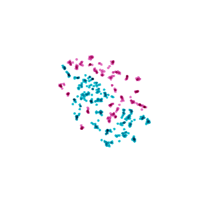
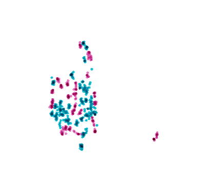
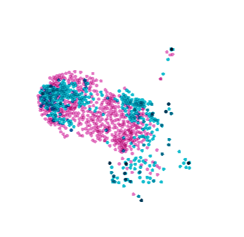
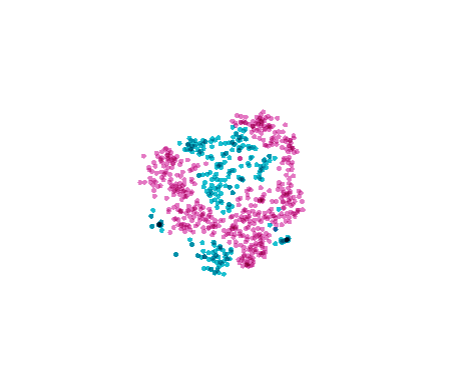
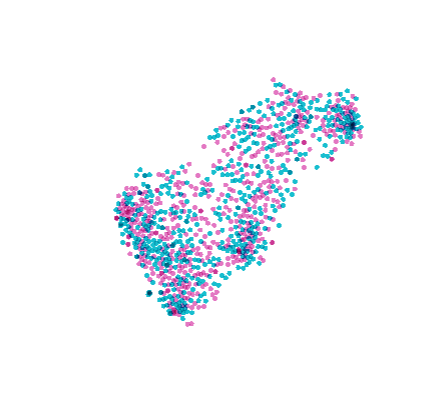

# Deepfake Detection In The Wild
>BJ Zi, MH Chang, XJ Ma, JJ Chen, YG Jiang,

>[Contact us](19210240030@fudan.edu.cn)
##  Abstact
   Deepfakes technology is a deep learning-based face forgery technique that can replace one's face with another's face, which we usually call 'AI face swap.' In recent years, the abuse of deepfake has sparked public concern.
Recently, dataset such as faceforensic++ and deepfake detection have filled in the gaps for deepfake detection datasets. Facebook also announced that it will release a data set for deepfake detection by the end of 2019.
However, due to the limited quality and generation of these datasets, there are great differences between the deepfake videos on the Internet and deepfake videos in these datasets, especially the deepfake videos uploaded on video sharing websites. These problems block further research in academic community.
To facilitate the study of deepfakes detection in real-world scenarios, we introduced a large-scale dataset which called `deepfake in the wild`. Our dataset is collected on the Internet and consists of 993 deepfake videos. We labeled each face motion sequence as real or fake so that we can develop deepfake research on the face motion sequence and image level.

Deepfake in the wild is a dataset collected on the web.

Our dataset contains 993 videos.

## Expriments
We use pretrained Resnet-101 to extracted features from provious datasets and our dataset, here is the comparsion:

</img>
</img>
</img>
</img>
</img>

## Download
[Baidu Drive](https://pan.baidu.com/s/1bYsie4Sz9vDWerBfGTyNxg)

passwd:8kqd

## Warning: 
This is not our final vision.
