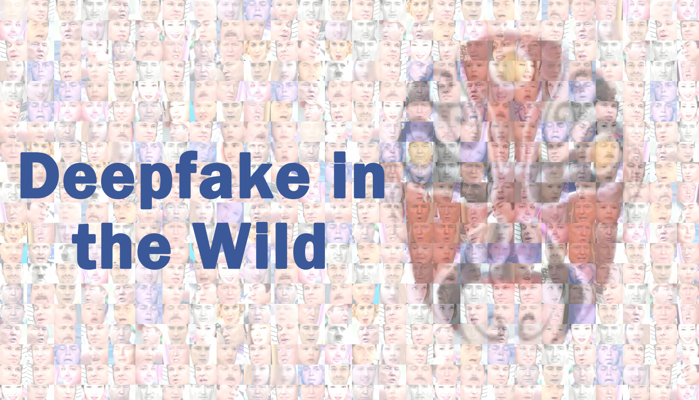
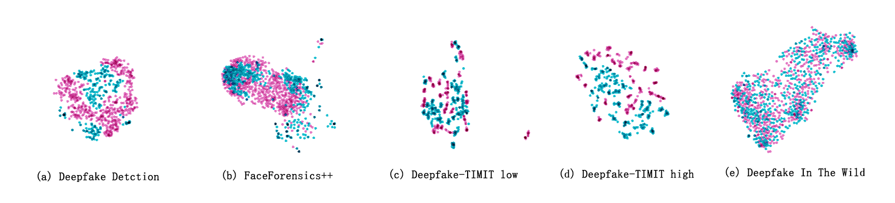

# Deepfake In The Wild
>BJ Zi, MH Chang, [XJ Ma](http://xingjunma.com/), JJ Chen, YG Jiang

>[Contact us](19210240030@fudan.edu.cn)
##  Abstact
   In recent years, the abuse of a technique called [Deepfake](https://github.com/shaoanlu/faceswap-GAN), which can be used to synthesize facial images, has drawn public attention. Recently, datasets such as [FaceForensics++](https://github.com/ondyari/FaceForensics) and [Deepfake Detection](https://ai.googleblog.com/2019/09/contributing-data-to-deepfake-detection.html) have been proposed to fill the gap in deepfake detection datasets. However, due to the poor quality of videos in these datasets, it is quite different from Deepfake videos on the Internet, especially Deepfake videos uploaded on the video sharing website, which hinders the further development of technologies to detect Deepfake videos. First，To facilitate the study of Deepfake detection in real-world situations, we proposed a dataset, **`Deepfake In The Wild`**. The videos in our dataset is completely collected on the Internet, consisting of **XXX** Deepfake videos and **XXX** face sequences extracted from these videos. We annotated each face sequence as real or fake so that we could carry out Deepfake detection on face sequence level as well as image level. Second, we proposed a novel method to detect Deepfake videos. The method forge the attention mask used in Deepfake technology. And then, the forged attention mask is used as a attention to increase the weight of the infomation of face generated by Deepfake. Extensive demonstrate have shown that our network performs favorably in the Deepfake detection methods.

</img>

## Introduction
   **TODO**
## Highlights

-**Collected from Internet**

-**well made**

## Our Method
   **TODO**
   
   We will upload our method in few days. Our method achieves state of the art in many datasets.
## Expriments
We use pretrained [Resnet-101](https://github.com/tensorflow/models/tree/master/research/slim) to extracted features from the images in provious datasets and our dataset. Here is the comparsion:

</img>

## Download
[Baidu Drive](https://pan.baidu.com/s/1bYsie4Sz9vDWerBfGTyNxg)

passwd:8kqd

## Warning: 
This is not our final vision.
