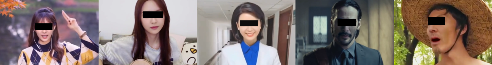

# WildDeepfake: A Challenging Real-World Dataset for Deepfake Detection

##  Abstact
   In recent years, the abuse of a face swap technique called deepfake Deepfake has raised enormous public concerns. Deepfake manipulates deep learning techniques to replace one person's face in a video to someone else's without leaving obvious traces.  So far, a large number of deepfake videos (also known as "deepfakes") have been crafted and uploaded to the internet, which calls for the development of effective countermeasures.One promising countermeasure against deepfakes is deepfake detection. Several deepfake datasets have been released to support the training and testing of deepfake detectors, such as DeepfakeDetection and FaceForensics++.While this has greatly advanced deepfake detection, most of the real videos in these datasets are filmed with a few volunteer actors in limited scenes, and the fake videos are crafted by researchers using a few popular deepfake softwares. Detectors developed on these datasets may lose effectiveness when applied to detect the vast variety of deepfake videos in the wild (those uploaded to varies video-sharing websites). To better support detection against real-world deepfakes, in this paper, we introduce a new dataset **WildDeepfake**, which consists of **7,314** face sequences extracted from **707** deepfake videos that are collected completely from the internet. WildDeepfake is a small dataset that can be used, in addition to existing datasets, to develop more effective detectors against real-world deepfakes.We conduct a systematic evaluation of a set of baseline detection networks on both existing and our WildDeepfake datasets, and show that WildDeepfake is indeed a more challenging dataset, where the detection performance can decrease drastically. We also propose two (eg. 2D and 3D) Attention-based Deepfake Detection Networks (ADDNets) to leverage the attention masks on real/fake faces for improved detection. We empirically verify the effectiveness of ADDNets on both existing and WildDeepfake.

</img>

## Introduction
   **Previous datasets**
   
   |       Dataset name       |         Download         |Generate method|      Deepfake videos     |           Actors           |
   |--------------------------|--------------------------|----|--------------------------|----------------------------|
   |   Deepfake-TIMIT low     |[download](https://www.idiap.ch/dataset/deepfaketimit)|Deepfake|320|32|
   |   Deepfake-TIMIT high    |[download](https://www.idiap.ch/dataset/deepfaketimit)|Deepfake|320|32|
   |   Faceforensics          |-|Deepfake|1000|977|
   |   Faceforensics++        |[download](https://github.com/ondyari/FaceForensics)|Deepfake|1000|977|
   |   Deepfake detection     |[download](https://ai.googleblog.com/2019/09/contributing-data-to-deepfake-detection.html)|Deepfake|over3000|28|
   |Celeb-deepfakeforensics v1|[download](https://github.com/danmohaha/celeb-deepfakeforensics)|Deepfake|795|13|
   |Celeb-deepfakeforensics v2|[download](https://github.com/danmohaha/celeb-deepfakeforensics)|Deepfake|590|59|
   |   DFDC                   |[download](https://deepfakedetectionchallenge.ai/)|Deepfake|-|-|
   
   **Ours**
   
   |       Dataset name       |         Download         |Generate method|      Deepfake videos     |           Actors           |
   |--------------------------|--------------------------|----|--------------------------|----------------------------|
   |   **WildDeepfake**   |[**download**](https://github.com/deepfakeinthewild/deepfake_in_the_wild#download)|**Download from Internet**|**707**|**about100**|

**Examples from previous datasets**

Deepfake-TIMIT

</img>

FaceForensics++

</img>

Deepfake Detection

</img>

DFDC

</img>

**Examples from ours**

WildDeepfake

</img>

**File Structure**:
~~~
deepfake_in_the_wild
                    |--real train
                                 |--0.tar.gz
                                 |--1.tar.gz
                                 |--2.tar.gz
                                 ...
                    |--real test
                                |--0.tar.gz
                                |--1.tar.gz
                                |--2.tar.gz
                                ...
                    |--fake train
                                 |--0.tar.gz
                                 |--1.tar.gz
                                 |--2.tar.gz
                                 ...
                    |--fake test
                                |--0.tar.gz
                                |--1.tar.gz
                                |--2.tar.gz
                                ...
~~~

In each tar.gz file, there will be several folders containing face images, and the images in each folder represent a face sequence.
The image name in the folder represents the frame number it appears in the original video.

## Highlights

-**Collected from Internet**

-**well made**

## Our Method
   **TODO**
   
   We will upload our method in few days. Our method achieves state of the art in many datasets.
## Expriments
First, we use pretrained [Resnet-101](https://github.com/tensorflow/models/tree/master/research/slim) to extract features from the images in previous datasets and our dataset. Then we use the [T-SNE](http://projector.tensorflow.org/) to reduce the dimensionality. Red points represent fake faces, green points represent real faces. Here is the comparsion:

</img>

## Download
[Baidu Drive](https://pan.baidu.com/s/1qPQlOCJbuzGAp4axETguoA)
passwd: [get here](https://www.our-wilddeepfake-projectpage.com)

## Warning: 
This is not our final vision.
